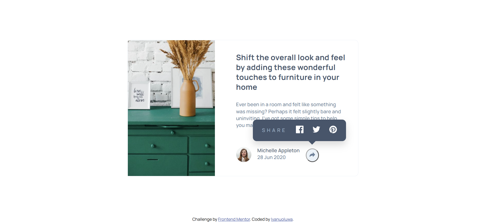

# Frontend Mentor - Article preview component solution

This is a solution to the [Article preview component challenge on Frontend Mentor](https://www.frontendmentor.io/challenges/article-preview-component-dYBN_pYFT). Frontend Mentor challenges help you improve your coding skills by building realistic projects. 

## Table of contents

- [Overview](#overview)
  - [The challenge](#the-challenge)
  - [Screenshot](#screenshot)
  - [Links](#links)
- [My process](#my-process)
  - [Built with](#built-with)
  - [What I learned](#what-i-learned)
  - [Continued development](#continued-development)
  - [Useful resources](#useful-resources)
  - [AI Collaboration](#ai-collaboration)
- [Author](#author)


## Overview

### The challenge

Users should be able to:

- View the optimal layout for the component depending on their device's screen size
- See the social media share links when they click the share icon

### Screenshot




### Links

- Solution URL: [https://github.com/Iyanu22/article_preview_component/actions]
- Live Site URL: [https://iyanu22.github.io/article_preview_component/]

## My process

### Built with

- Semantic HTML5 markup
- CSS custom properties
- Flexbox
- CSS Grid
- Mobile-first workflow

### What I learned

This project reinforced a lot of debugging fundamentals that go beyond just writing CSS — most of my real learning came from tracking down *why* styles weren't behaving as expected:

- **CSS specificity and nesting depth must match exactly between a base rule and its media query override.** Several times, a tablet/desktop override failed silently because its SCSS nesting was one level shallower than the base rule it was trying to override — e.g., skipping `.card-body` in the chain meant the compiled selector had lower specificity than the original mobile rule, so the mobile styles kept winning even though the media query was correctly active.

```scss
// This looked right but had LOWER specificity than the base rule,
// because .card-body was missing from the nesting chain:
@media(min-width: $breakpoint-tablet){
    .container{
        .author-info{
            .share-popup{ ... }
        }
    }
}
```

- **`max-width` on a child can never exceed a `max-width` set on its parent.** I hit this with both `main`/`.container` and the share popup's positioning — a child's width constraint is silently capped the moment any ancestor up the chain has a smaller `max-width`.

- **Positioning context matters as much as the position values themselves.** For the share popup, `position: absolute` initially anchored to the wrong ancestor (`.container` instead of `.share-icon`), which pulled the popup toward the top of the whole card instead of directly above the button. Using `bottom: calc(100% + 1rem)` relative to the button itself, rather than a manually guessed `top` offset relative to a larger container, made the positioning far more resilient to content height changes.

- **`z-index` only works between elements that both have a `position` value other than `static`.** The share button disappeared behind the popup until both elements were given an explicit `position` and layered `z-index` values.

- **A missing CSS reset causes real layout bugs, not just minor spacing differences.** Default browser margins on `h1`/`h3`/`p` were responsible for unwanted gaps that looked like a flexbox/gap problem until I added a proper `* { margin: 0; padding: 0; box-sizing: border-box; }` reset at the top of the file.

### Continued development

- Getting faster at recognizing specificity and nesting-depth mismatches before they cost a full debugging cycle — ideally catching a shallow media query override on sight rather than after testing
- More practice with CSS pseudo-elements (like the popup's connecting tail) for small decorative UI details
- Building a stronger habit of checking parent elements first whenever a `max-width` or `position: absolute` isn't behaving as expected, rather than re-checking the child rule repeatedly

### AI Collaboration

I used Claude throughout this project for debugging layout and positioning issues, understanding *why* CSS specificity and nesting affected which rules won the cascade, and working through the share-popup's toggle logic and floating positioning across breakpoints.
## Author
- Frontend Mentor - [@Iyanu22](https://www.frontendmentor.io/profile/Iyanu22)

